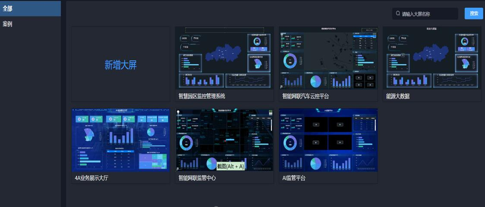

# aiot-data

#### 介绍
AIOT人工智能物联网平台是一站式物联网开发基础平台，帮助企业快速实现数字化、精细化数据管理。核心系统为：物联网平台 + 数据中台（数据底座）+ AI。
欢迎大家添加最下方的微信入群交流。

## 物联系统介绍
  系统包含了品类、物模型、消息转换、插件管理（mqtt插件、EMQX插件、http插件、tcp插件、modbus插件等）、设备管理、设备分组、规则引擎、数据流转（http/mqtt/kafka）、数据可视化、告警中心等模块。

## 数据中台介绍
  系统包含了数据集成，数据开发，数据治理，数据资产，数据服务，数据集市六大模块，解决数据孤岛问题，实现数据统一口径标准，自定义数据开发任务。

## AI平台介绍
  系统包含了缺陷检测、烟火检测、安全帽检测、车流检测、车辆检测、入侵检测、车牌检测、花检测、动物检测、口罩检测、人流检测等等AI模型。并且支持训练、标注等功能。

## 大屏设计及报表
  系统支持自定义报表、大屏设计功能，全拖拽式实现，满足不同自定义演示需求。

#### 软件架构说明
  本系统采用springboot、spring cloud、vertx、redis、H2、mysql、elasticsearch、TDEngine、RocketMq、flink、hadoop、kafka、Vue3、Mybatis-Plus、minio、k8s等框架和第三方软件，中间件采用模块化无侵入集成非常容易扩展和替换。

#### 系统部分截图

  物联网功能

  数据平台功能

  数据平台功能

  AI功能

  大屏设计功能

  大屏设计功能

#### 微信群(添加我微信备注"进群"):

